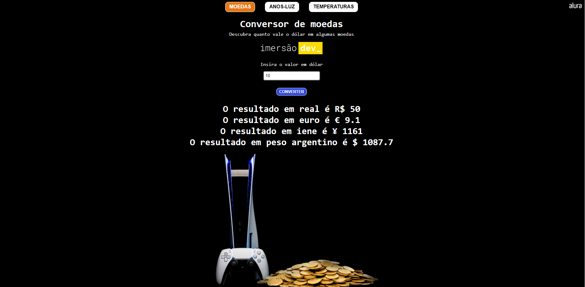

<h1 align="center">Conversor - Imersão Dev - Aula 2</h1>

<a href="https://brunosabbagmachado.github.io/imersao-dev2-conversor/">Site</a> de Conveter moedas, anos-luz e temperatura, criado durante o Dia 2 da Imersão Dev da Alura.

    
    
    

    

# Tabela de conteúdos

<!--ts-->
- [Sobre](#Sobre)
- [Projeto](#O-Projeto)
- [Imagens](#Imagens)
- [Conclusão](#Conclusão)
- [Sobre mim](#Sobre-mim)
<!--te-->

# Sobre

Estou participando da Imersão Dev da [Alura](https://www.alura.com.br/), que está acontencendo agora no começo de março 2022. 

Esta página foi criada após a conclusão do segundo dia da Imersão.

O objetivo da aula era construir uma página de Converter moedas. Mais precisamente uma página que converte dólar em real. 

O HTML e o CSS foram criados pela Alura e durante a aula aprendemos e fizemos o JavaScript.

 

# O Projeto

O código do JavaScript que construímos consiste em uma função que seleciona o dado que o usuário escreve no input do HTML, transforma esse dado em número e então faz uma conta matemática para converter o número na moeda real.

Ao final da aula, os instrutores propuseram quatro desafios:
- implementar o código para que fossem feitas conversões para outras moedas além do real;
- criar um código que convertesse quilómetros em anos-luz;
- criar um código que convertesse graus Celsius em outras temperaturas;

Para concluir os desafios, eu separei o projeto em três arquivos HTML, que contém a mesma estrutura, com pequenas alterações no nome das classes. Dessa forma o usuário pode alterar rapidamente entre os três projetos.

No CSS, complementei o que já havia sido criado pela Alura, fazendo alterações de imagens e também mudando a estilização dos botões presentes nas páginas.

No JS, utilizei da mesma lógica que aprendi na Imersão para criar o código que transformasse Celsius em outras temperaturas e quilómetros em anos-luz. Também inseri outras moedas e implementei os quatro resultados de uma única vez no HTML.

Atualização Setembro 2022: hoje, refatorei o projeto, fazendo todo o dinamismo de troca de página acontecer via JavaScript e reduzindo o número de arquivos HTML para apenas um.

# Imagens

<h2 align="center">Conversor de Moedas</h2>

    

 

<h2 align="center">Conversor de Anos-luz</h2>

    

 

<h2 align="center">Conversor de Temperatura</h2>

    

# Conclusão

Com esse projeto retomei meus estudos de JavaScript que estavam parados desde o começo do ano e aprendi melhor como posso, através do JS, utilizar e transformar elementos criados no HTML.

Também foi muito interessante trabalhar em um projeto onde o HTML e o CSS já estavam criados, e pude incrementar e trasnformar eles.

# Sobre mim

Oi, eu sou o Bruno e é uma honra ter você aqui.

Espero que tenha gostado do projeto. Fique a vontade para comentar, ou até melhorar o código. Será um prazer compartilhar conhecimentos.

Me siga aqui no [Github](https://github.com/brunosabbagmachado) e também no [Linkedin](https://www.linkedin.com/in/brunosabbagmachado/). Vou te seguir de volta e será uma horna ter você na minha rede.
